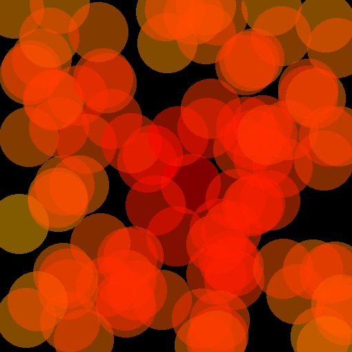

# leader_algorithm_choice

Les outils proposés dans ce dépôt permettent:

- de définir des réseaux dont les connexions dépendent de la distance entre 2 noeuds (comme dans le cas de réseaux sans fil)
- de déterminer, pour une configuration donnée, quel algorithme permet d'obtenir le noeud du réseau d'excentricité minimale (recherche du centre géométrique, recherche du centre de gravité, ABC-Center ou k-BFS)
-  de produire une représentation graphique d'un réseau
-  en combinant les possibilités données ci-dessus, de produire un lot de représentations graphiques pour un lot de configurations stockées dans des fichiers `csv`, en classant les images obtenues par algorithme vainqueur. On produit ainsi des données pouvant être acceptées en entrée d'un réseau de neurones convolutif.

Les représentations graphiques produites par cette version sont sur deux canaux (rouge/vert). 

Finalité de ces représentations graphiques: il s'agit de voir si un réseau de neurones convolutif peut reconnaître les configurations pour lesquelles la seule recherche du centre géométrique ne suffit pas pour trouver un noeud d'excentricité minimale.

## Les programmes Python
### 1. Le programme monde_robots.py

Ce programme permet de créer/Visualiser/Modifier une configuration.

Lorsqu'on lance le programme depuis un interpréteur Python. La fenêtre de gauche représente l'espace dans lequel évoluent les nœuds du réseau. La création de nouveau nœuds se fait à la souris, les nœuds peuvent être déplacés par cliquer-déplacer et supprimés par un clic-droit.

Les cases à cocher "centreGrav", "centreGeom" et "kBFS" permettent de colorier respectivement le centre de gravité en rouge, le centre géométrique en vert et les vainqueurs de l'algorithme kBFS en cyan.

La case "affichage" permet de visualiser dans la console des étapes intermédiaires des algorithmes itératifs.

Le bouton "Best" affiche dans la console les performances (numéro du nœud, excentricité) des leaders obtenus par 5 algorithmes (centreGeom, centreGrav, ABC-Center, slowABC, 10-BFS) ainsi que le noeud d'excentricité minimale. Il détermine l'algorithme vainqueur en choisissant en cas d'égalité le premier dans la liste.

Le bouton "importer une configuration" permet de choisir un fichier `csv` indiquant les positions des noeuds.  
L'exemple ci-dessous donne le format attendu:

&nbsp;&nbsp;&nbsp;&nbsp;&nbsp;&nbsp;id, x, y, portee  
&nbsp;&nbsp;&nbsp;&nbsp;&nbsp;&nbsp;6, 89.38286224583192, 274.21103835165434, 85  
&nbsp;&nbsp;&nbsp;&nbsp;&nbsp;&nbsp;....

Les dossiers compressés `10000_uniforme_100_all.zip` et `10000_uniforme_10_a_200_all.zip` contiennent chacun 10 000 configurations enregistrées sous ce format.

### 2. Le programme cree_configurations.py

Ce programme permet de travailler sur des lots de configurations.

L'utilisation des principales fonctions est guidée par une série de menus.

Menu principal:  

1. Créer une série de configurations et les classer.    
2. Reconstruire (sans reclasser) les représentation graphiques d'une série de configurations.  
3. Comparer les performances de plusieurs algorithmes sur une série de configurations.  
4. Reconstruire et reclasser les représentation graphiques d'une série de configurations classées.  
5. Quitter.  
 
Pour reconstruire les images à fournir à un CNN    
(après avoir décompressé un des deux dossiers fournis, `10000_uniforme_100_all.zip` ou `10000_uniforme_10_a_200_all.zip`): 

- lancer le programme depuis le dossier contenant `10000_uniforme_100_all` ou `10000_uniforme_10_a_200_all`. Ce dossier doit contenir un sous-répertoire `csv`
- choisir l'option 4 et suivre les indications. Le programme créera, à coté du dossier `csv`, un dossier `nouveau` (si vous avez choisi ce nom) contenant trois sous-répertoires `train`, `validation` et `test` puis, dans chacun des ces répertoires, un dossier par algorithme.

### 3. Le programme execution_directe_series.py

Le script de ce programme montre des exemples d'utilisation des fonctions de `cree_configurations.py` sans passer par les menus interactifs, ce qui permet d'enchaîner plusieurs actions.

## Traitement par un réseau de neurones

Le notebook Jupyter `10_a_200_2_canaux_centreGeom_kBFS.ipynb`donne un exemple de traitements réalisés.
